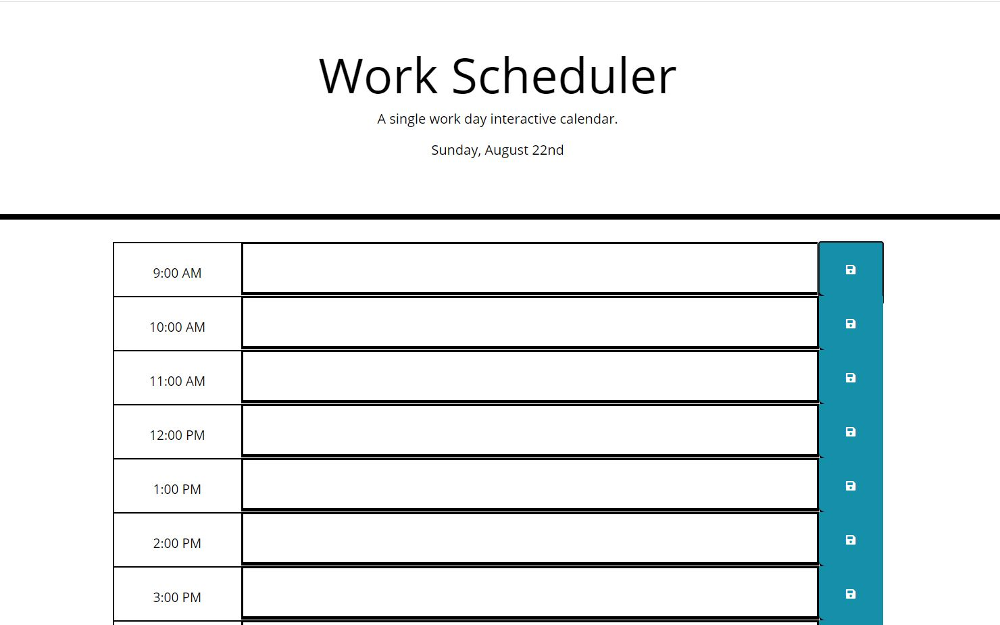

# Work_Scheduler

A calendar application run on a browser that will be dynamically updated by HTML, CSS, and jQuery.

## User Story

>AS AN employee with a busy schedule
>I WANT to add important events to a daily planner
>SO THAT I can manage my time effectively

## Acceptance Criteria

An active locally saved calendar. Depending on the time of the day, it will update in separate colors representing past, present, and future.

## Mock-up

## Installation

* Visual Studio Code
* HTML
* CSS
* JavaScript
* Bootstrap
* Moment.js

## Links

Github: <https://github.com/SarahKubik/Work_Scheduler.git>

URL: <https://sarahkubik.github.io/Work_Scheduler/>
